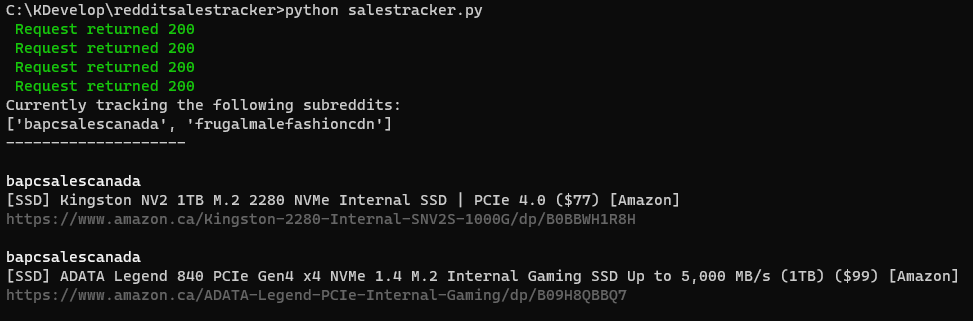

# RedditSalesTracker

RedditSalesTracker (RST) is a simple tracker for posts on sales-specific subreddits.

## Prerequisites

- \>= [Python 3.11.0](https://www.python.org/downloads/)
- Requests

```
$ python -m pip install requests
```

- == playsound 1.2.2

```
$ python -m pip install playsound==1.2.2
```

- [Reddit API access](https://github.com/reddit-archive/reddit/wiki/OAuth2)

## Usage

1. To automate the authentication process, you can create a credentials.json file in the top level directory
   > i.e. it should look something like:

```
{
    "app_id": "your_appid",
    "secret": "your_secret",
    "reddit_username": "your_username",
    "reddit_password": "your_password"
}
```

2. Modify the subreddits.csv to track your preferred subreddits
   > currently the default subreddits are:

```
bapcsalescanada,buildapcsales,frugalmalefashioncdn,frugalmalefashion,canadianhardwareswap
```

3. Run the app by executing:

```
$ python salestracker.py
```

Optionally, you may use command line arguments to specify the sorting method, the number of initial posts per subreddit, a comma seperated list of subreddits, or sounds

> Defaults: sorting - 'new', number of posts - 10, mute - False (Will play sounds)

```
$ python salestracker.py -s top -n 5 -r bapcsales,mechmarket -s t
```



## Development

### Development Prerequisites

- Prettier

### To do
